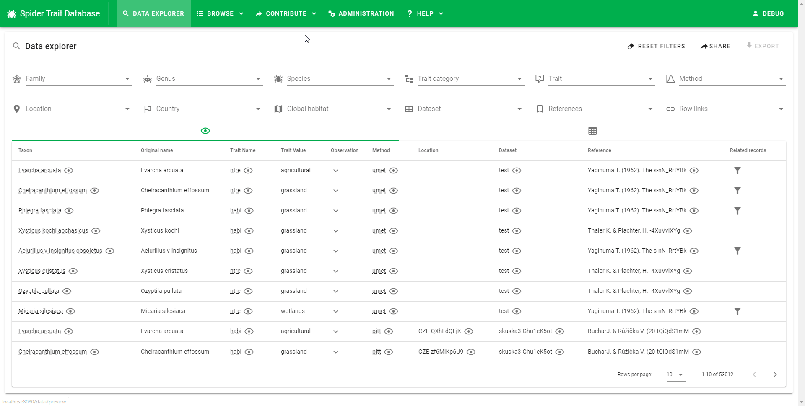

# Data editor capabilities

The editor is a user that can contribute datasets and that also approves all datasets. The editor checks datasets uploaded by contributors and must ensure that all the data are fully valid. Otherwise, the system will not allow approval of the dataset. This usually means that the editor may need to create new entities in the database: references, methods, or new traits.

Once the dataset is approved for the database all the data are transferred from the temporary import cache to the main database and become available to the general public to view and download.

The types of edits that can be performed using the data editor include:

* Providing a missing required value
* Replacing an unrecognized value with a value from an enumeration list (e.g. fixing typos, replacing synonyms)
* Replacing unparsable values with valid representations (numbers, timestamps, coordinates)
* Deleting records that cannot be validated
* Creating new entities (references, methods, traits)

The editor can view all datasets that are not approved, but can edit only those which are under review. Datasets can be reviewed from a different section of the application, available under `Contribute` / `Approve datasets` in the top menu.

See [guidelines on how to edit the dataset](editor-howto.md) for more information.

