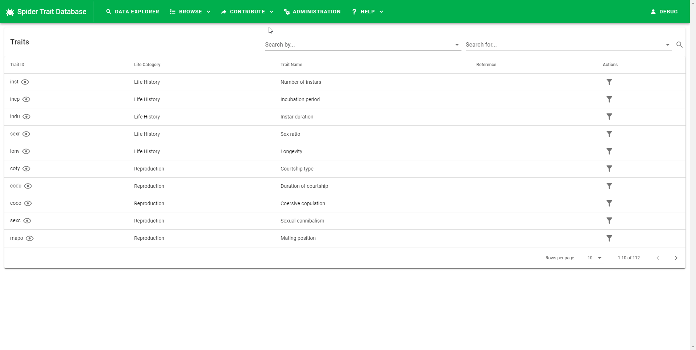
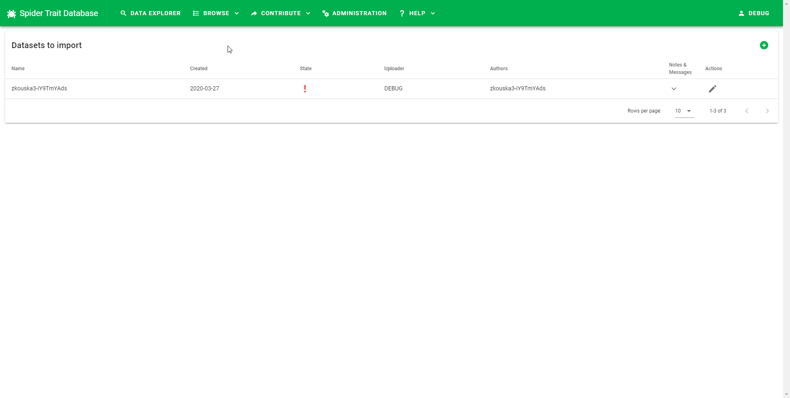

# Guide to data submission

This page covers the procedure and rules of data submission to the Spider Trait Database. It also provides a tutorial on data modification using the online data editing tool.

If you want to contribute data to the database, please [contact the administrator](mailto:spidertraits@group.muni.cz?subject=Spider%20Traits%3A%20Request%20for%20Access&body=Hello%2C%20I%20would%20like%20to%20request%20the%20access%20for%20the%20Spider%20Traits%20Database%20access.%0D%0A%0D%0A---%20Please%20provide%20more%20detail%20about%20your%20request%20(e.g.%20information%20about%20the%20data%20you%20want%20to%20upload)%3A%20---). You will receive a username and a password, which will give you access to the submission page.

## Preparation of the dataset

Before the dataset can be supplied to the database, the data must be in a valid format. Please download the [Template](https://github.com/oookoook/spider-trait-database/raw/master/docs/template.xlsx) spreadsheet and fill in your data. The spreadsheet includes two sheets. The first, titled *data*, contains 31 columns that can be filled. The definitions of the columns are given in comments to the cells or can be found in the [template documentation](template.md). The second sheet, titled *examples*, includes examples on how to fill in your data. Some columns in the first sheet are mandatory (highlighted in red or orange), which means that all cells in these columns must be filled with appropriate numerical or character values. Either the red or orange columns must be filled (not both). Eligible values for the red columns can be found in the List of Traits and List of Methods on the Spider Trait Database webpage (under the Browse button). Specifically, the contributor should provide either only the `trait_abbrev` if the trait already exists in the List of Traits or all of the following – `trait_category`, `trait_name`, `trait_description`, `trait_data_type`, and `trait_unit –` if there is no such trait defined. The `trait_abbrev` will be proposed for such cases later by the editor. The contributor should also provide either only the `method_abbrev` if the method already exists in the List of Methods or both the `method_name` and `method_description` if there is no such method defined. The `method_abbrev` will be proposed for such cases later by the editor. Similarly, for references, the contributor either provides a code according to the List of References in the `reference_abbrev` column or a full citation in `reference` if the source is not in the references list. The `reference_abbrev` will be generated and assigned to the correct records by the application.

The data should then be saved either as an Excel or a CSV (comma separated) file. In case of CSV file the values should be separated by commas. Furthermore, the file should be encoded as UTF-8 otherwise characters from national alphabets (accents) will not be correctly processed. The CSV files can be converted to the UTF-8 using, for example, Notepad within Windows by choosing _UTF-8_ encoding from the menu while saving the file.

## Submission procedure

TODO check english?

The entry point to data submission process is a list of submitted datasets. Contributors can view their submitted datasets here or add new ones. The list is located in the top menu under `Contribute` -> `Import datasets`.

There are several states the dataset can be in:

+ New - Contributors can edit the dataset by clicking the pen icon on the right. (View [Animation](https://github.com/oookoook/spider-trait-database/raw/master/docs/img/new-dataset.gif))
+ Under review - Contributors cannot edit the dataset as it was submitted for the review. (View [Animation](https://github.com/oookoook/spider-trait-database/raw/master/docs/img/reviewed-dataset.png))
+ Rejected - Contributors can edit the dataset by clicking the pen icon on the right. They can also view any message editor left them by clicking the arrow down. (View [Animation](https://github.com/oookoook/spider-trait-database/raw/master/docs/img/rejected-dataset.gif))

END TODO

The first step when uploading new data to the database is to create a new dataset by clicking the (green) *plus* sign in the upper right corner of the webpage. A new dataset form will appear.

You will need to fill in the following information:

+ Dataset name - Generated automatically, but can be changed to a user defined value. The dataset name must be unique, but a unique random id is attached to the provided name so that the contributor does not have to worry about the uniqueness of the dataset name.
+ Uploader name - Mandatory field. Automatically filled in from the user profile, but can be changed by the user.
+ Uploader e-mail - Mandatory field. E-mail of the person who uploads the data. It will be available only to the editor and administrator and used to contact the author uploader.
+ Authors – Optional. List of authors of the dataset. This may or may not include the uploader.
+ Author email(s) – Optional. E-mail address(es) of the author(s). It/They will be available only to the editor and administrator.
+ Notes – Optional. Any additional information passed to the editor concerning the dataset.

Then, the dataset sheet is created and the contributor is able to upload the data. The data from a file can be uploaded by clicking the "Upload button". The data from the Template spreadsheet will be imported to the temporary cache, where the dataset awaits approval by the editor.

At this stage, the contributor can look at the dataset and edit it using the tools of the web application in the green bar above the spreadsheet. The editing interface notifies users about invalid records and properties in the dataset by highlighting such cells in red. The contributor must edit the data in order to comply with the database requirements. See [guidelines on how to edit the dataset](editor-howto.md) for more information.

When the contributor completes the changes and the dataset is valid, he/she can send the dataset to the editor for review (by clicking the *Send for review* button). The contributor can include a message to the editor when submitting the dataset for review in which he/she can explain any problems he/she had encountered while editing the dataset.

Once the dataset is validated by the editor it will be submitted to the database. This means that all the data are transferred from the temporary import cache to the main database and become available to the general public to view and download.

If the dataset is rejected by the editor, the contributor can edit the dataset again by clicking the pen icon on the right. He/she can also view any message from the editor by clicking the arrow that points downward.
