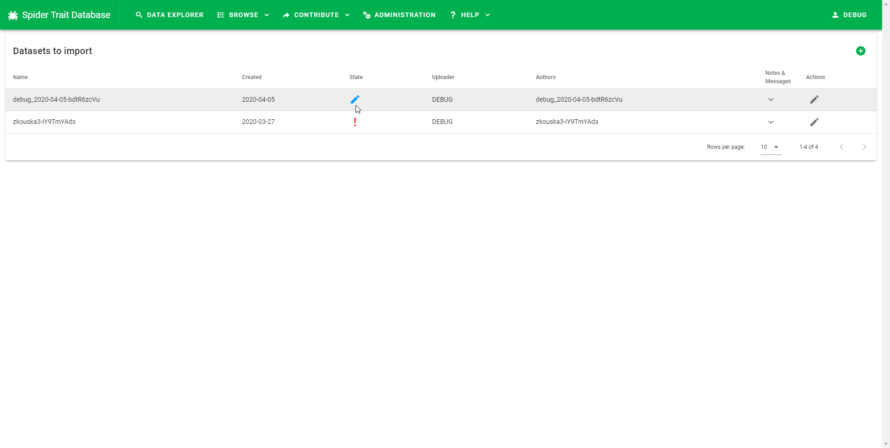
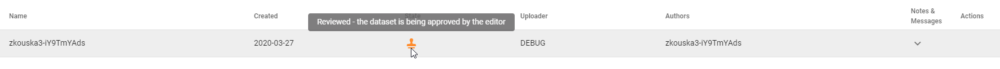
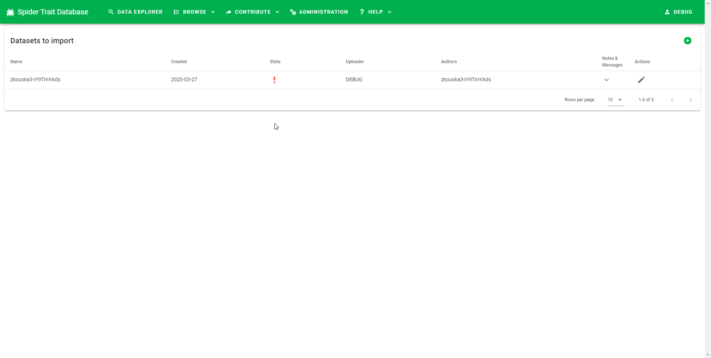
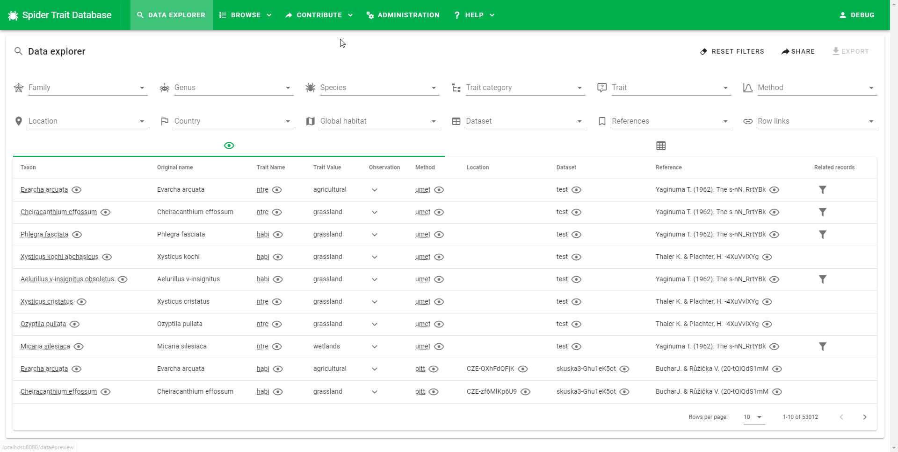
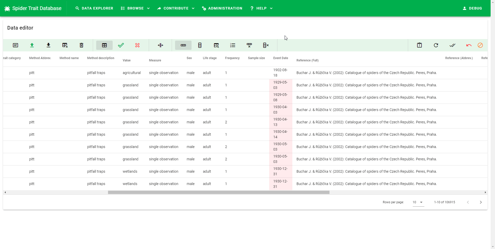
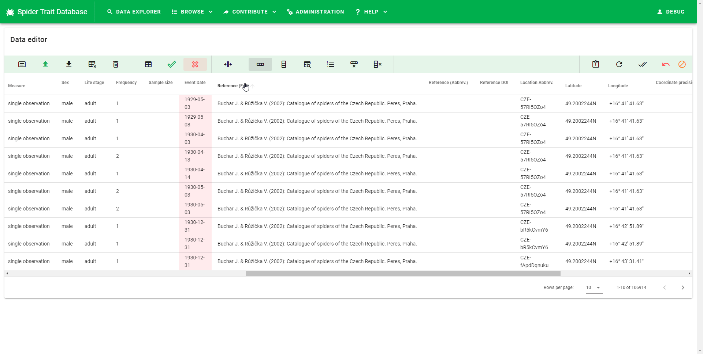

# Data editor How To

Data editor is the tool that contributors and editors use to view the uploaded data and edit them to make the dataset valid - i.e. transform the data to a format that complies with the requirements of the Spider Trait Database data model. This document is a practical How To guide on using the data editor. You might also want to read the [full overview of the data submission process](data-submission.md).

## Data editor capabilites

The types of edit that can be done using the data editor are:

+ Providng a missing required value
+ Replacing an unrecognized value with a value from an enumeration list (e.g. fixing typos, replacing synonyms)
+ Replacing unparsable value with a valid representation (numbers, timestamps, coordinates)
+ Deleting records that can't be made valid
+ Creating new entites (references, locations, methods, traits) - editors only

## Viewing existing unprocessed datasets

The entry point to data submission process is a list of submitted datasets. Contributors can view their submitted datasets here or add new ones. The list is located in the top menu under `Contribute` -> `Import datasets`.

There are several states the dataset can be in:

### New

Contributors can edit the dataset by clicking the pen icon on the right.

### Under review

Contributors cannot edit the dataset as it was submitted for the review.

### Rejected

Contributors can edit the dataset by clicking the pen icon on the right. They can also view any message editor left them by clicking the arrow down.

## Creating a new dataset

User can add new dataset by clicking the green "plus" button in the top right. Then, a new dataset form appears. Dataset name and uploader name are filled in automatically, but the uploader e-mail must be provided. The other properties are not mandatory. After filling in the information, a new dataset is created.

## Viewing datasets under review (editor only)

Editor can view all the datasets that are not approved, but they can edit only those which are under review. Datasets can be reviewed from a different section of the application, available under `Contribute` -> `Approve datasets` in the top menu. The user interface is identical to the one for contributors, but different datasets can be edited.

## Data editor toolbar

The data editor is controlled by the toolbar placed on top of the data table.

Tooblar buttons from left to right are divided to several groups:

### Dataset-level operations

Buttons in this group affect the whole datasets or all the records.

+ Dataset detail - Opens the dataset detail form. Allows to view and edit the dataset properties (Dataset name, Uploader name, Authors,..)
+ Upload data - After clicking the button, dialog appears that allows to select Excel or CSV file from the hard drive and upload it to the server. This can take some time. For 50 000 records, the upload time is about 8 minutes.
+ Download as CSV - Can be used to save the current state of the dataset to user's hard drive. The file than can be used as a backup or can be modified in a table processor such as Excel to perform more complex edits and then be reuploaded to the Spider Trait Database.
+ Delete all the data - Deletes all the rows, but keeps the empty dataset. Requires confirmation before deleting.
+ Delete the dataset - Deletes all the data, as well as the dataset information itself. Requires confirmation before deleting.

### Data filters

The data filters help the user to identify the rows that require edits. The number of records in the bottom right corner of the table can help to determine the total count of records of each type.

+ Show all records - no filter is applied.
+ Show valid rows - only valid rows are shown.
+ Show invalid rows - only invalid rows are show.

### Data display

The only button in the display section toggles between shortening long values to make the sheet more compact and easy to work with and viewing the unaltered values.

### Data editing

The buttons in this section are used for modifying the data. The following section provides tutorials on the common tasks.

+ Edit only the selected cell - edits a single value.
+ Edit the selected value in the whole column - serves as a batch replace of values in one column. Used e.g. for correcting typos or replacing synonyms with accepted values (e.g. `minimum` to `min` in the `measure` column)
+ Use this value as rule for value change - Used for operations such as "If value in column A is X, then put value Y in column B". Can be used for various tasks such as filling in trait or method description based on trait/method name or providing additional information (reference DOI, WSC LSID based on original name).
+ View distinct values in the selected column - This button list all distinct values in the column. Replacement rules described above can be executed using the items from the distinct list. Also, the dialog that open allows for displaying *Distinct entities* for certain columns (`trait_*`, `method_*`,`location_*`, `reference_*`). From that dialog, it is possible to create the entities (i.e. trait, method, location, or reference) that don't exist in the catalog.
+ Delete selected row - deletes the selected row. Requires confirmation before deleting.
+ Delete all rows containing selected value - Deletes all the rows that contain selected value in the selected column. Requires confirmation before deleting.

### Utilities

Buttons in this group are utility buttons that can be used in special cases or when something is not working as expected.

+ Open error log - Opens a log of errors. Erros can occur when app crashes and is reloaded or when editor attempts to create new entities (methods, traits) and operation fails (e.g. the entity name is not unique).
+ Refresh the table - Requests the data from the server and displays them.
+ Revalidate the whole dataset - Can be used if the automatic validation fails for some reason. This operation can take some time (45 seconds for 50 000 records).

### Data submission steps

Buttons in the last group are used for changing the state of the dataset to one of the possible values: `reviewed`, `rejected`, `approved`.

+ Send for review (contributor only) - Allows the contributor to send the dataset for review. The contributor is notified by the color of the button (orange) and also by the message in the opened dialog if the dataset is not valid. If the dataset is valid, the icon is green. After clicking, confirmation dialog opens. The contributor can also attach message to the editor when submitting.
+ Reject (editor only) - Rejects the dataset. The dataset is returned to the contributor with an optional message describing the problems and editor's requests.
+ Approve (editor only) - This button is active only if the dataset is fully valid. Otherwise, a red inactive icon is shown. If the button is active, it transfers the dataset to the Spider Trait Database.

## Data editing examples

### Providng a missing required value

### Replacing an unrecognized value with a value from an enumeration list (e.g. fixing typos, replacing synonyms)

### Replacing unparsable value with a valid representation (numbers, timestamps, coordinates)

### Deleting records that can't be made valid

### Creating new entites (references, locations, methods, traits) - editors only
