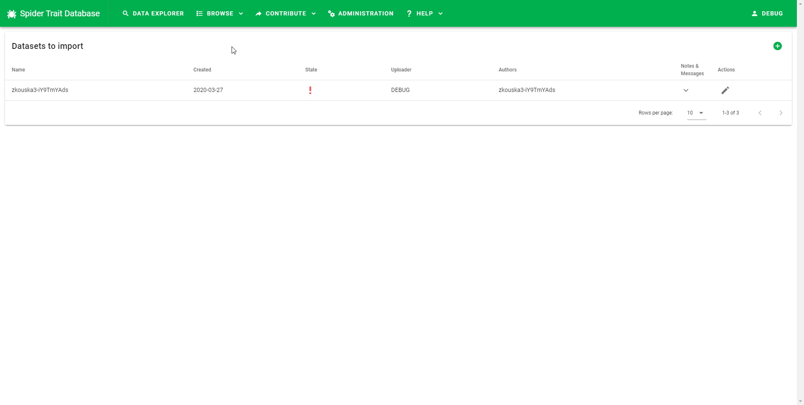

# Data editor How To

Data editor is the tool that contributors and editors use to view the uploaded data and edit them to make the dataset valid - i.e. transform the data to a format that complies with the requirements of the Spider Trait Database data model. This document is a practical How To guide on using the data editor. You might also want to read the [full overview of the data submission process](data-submission.md).

## Data editor capabilites

The types of edit that can be done using the data editor are:

+ Providng a missing required value
+ Replacing an unrecognized value with a value from an enumeration list (e.g. fixing typos, replacing synonyms)
+ Replacing unparsable value with a valid representation (numbers, timestamps, coordinates)
+ Deleting records that can't be made valid
+ Creating new entites (references, locations, methods, traits) - editors only

## Viewing existing unprocessed datasets

The entry point to data submission process is a list of submitted datasets. Contributors can view their submitted datasets here or add new ones. The list is located in the top menu under `Contribute` -> `Import datasets`.

There are several states the dataset can be in:

### New

Contributors can edit the dataset by clicking the pen icon on the right.

### Under review

Contributors cannot edit the dataset as it was submitted for the review.

### Rejected

Contributors can edit the dataset by clicking the pen icon on the right. They can also view any message editor left them by clicking the arrow down.

## Creating a new dataset

User can add new dataset by clicking the green "plus" button in the top right. Then, a new dataset form appears. Dataset name and uploader name are filled in automatically, but the uploader e-mail must be provided. The other properties are not mandatory. After filling in the information, a new dataset is created.

## Viewing datasets under review (editor only)

Editor can view all the datasets that are not approved, but they can edit only those which are under review. Datasets can be reviewed from a different section of the application, available under `Contribute` -> `Approve datasets` in the top menu. The user interface is identical to the one for contributors, but different datasets can be edited.

## Data editor toolbar

The data editor is controlled by the toolbar placed on top of the data table.

Tooblar buttons from left to right are divided to several groups:

### Dataset-level operations

Buttons in this group affect the whole datasets or all the records.

+ Dataset detail - Opens the dataset detail form. Allows to view and edit the dataset properties (Dataset name, Uploader name, Authors,..)
+ Upload data - After clicking the button, dialog appears that allows to select Excel or CSV file from the hard drive and upload it to the server. This can take some time. For 50 000 records, the upload time is about 8 minutes.
+ Download as CSV - Can be used to save the current state of the dataset to user's hard drive. The file than can be used as a backup or can be modified in a table processor such as Excel to perform more complex edits and then be reuploaded to the Spider Trait Database.
+ Delete all the data - Deletes all the rows, but keeps the empty dataset. Requires confirmation before deleting.
+ Delete the dataset - Deletes all the data, as well as the dataset information itself. Requires confirmation before deleting.

### Data filters

The data filters help the user to identify the rows that require edits. The number of records in the bottom right corner of the table can help to determine the total count of records of each type.

+ Show all records - no filter is applied.
+ Show valid rows - only valid rows are shown.
+ Show invalid rows - only invalid rows are show.

### Data display

The only button in the display section toggles between shortening long values to make the sheet more compact and easy to work with and viewing the unaltered values.

### Data editing

The buttons in this section are used for modifying the data. The following section provides tutorials on the common tasks.

+ Edit only the selected cell - edits a single value.
+ Edit the selected value in the whole column - serves as a batch replace of values in one column. Used e.g. for correcting typos or replacing synonyms with accepted values (e.g. `minimum` to `min` in the `measure` column)
+ Use this value as rule for value change - Used for operations such as "If value in column A is X, then put value Y in column B". Can be used for various tasks such as filling in trait or method description based on trait/method name or providing additional information (reference DOI, WSC LSID based on original name).
+ View distinct values in the selected column - This button list all distinct values in the column. Replacement rules described above can be executed using the items from the distinct list. Also, the dialog that open allows for displaying *Distinct entities* for certain columns (`trait_*`, `method_*`,`location_*`, `reference_*`). From that dialog, it is possible to create the entities (i.e. trait, method, location, or reference) that don't exist in the catalog.
+ Delete selected row - deletes the selected row. Requires confirmation before deleting.
+ Delete all rows containing selected value - Deletes all the rows that contain selected value in the selected column. Requires confirmation before deleting.

### Utilities

Buttons in this group are utility buttons that can be used in special cases or when something is not working as expected.

+ Open error log - Opens a log of errors. Erros can occur when app crashes and is reloaded or when editor attempts to create new entities (methods, traits) and operation fails (e.g. the entity name is not unique).
+ Refresh the table - Requests the data from the server and displays them.
+ Revalidate the whole dataset - Can be used if the automatic validation fails for some reason. This operation can take some time (45 seconds for 50 000 records).

### Data submission steps

Buttons in the last group are used for changing the state of the dataset to one of the possible values: `reviewed`, `rejected`, `approved`.

+ Send for review (contributor only) - Allows the contributor to send the dataset for review. The contributor is notified by the color of the button (orange) and also by the message in the opened dialog if the dataset is not valid. If the dataset is valid, the icon is green. After clicking, confirmation dialog opens. The contributor can also attach message to the editor when submitting.
+ Reject (editor only) - Rejects the dataset. The dataset is returned to the contributor with an optional message describing the problems and editor's requests.
+ Approve (editor only) - This button is active only if the dataset is fully valid. Otherwise, a red inactive icon is shown. If the button is active, it transfers the dataset to the Spider Trait Database.

## Data editing examples

In the following section, typical data editing tasks are described in more detail.

### Editing singe cell

This functionality can be used e.g. for correcting typos or incorrectly parsed text.

### Replacing an unrecognized value with a value from an enumeration list (e.g. fixing typos, replacing synonyms)

To replace synonyms in the dataset, it is possible to use the *Edit the selected value in the whole column* action. If the value must comply to an enumeration, the autocomplete function can be used. If large number of values is replaced, this operation can take a while (around 1 minute for 50 000 records).

### Providing a missing value

In some cases the above apprach can't be used. For example when the target column is empty but it should contain multiple distinct values. In such cases, we can use values in another column to serve as a rule for the replacement: *If column A contains value X, replace value in column B with value Y*. As in the previous case, the operation can take a while for large datasets.

Example:

> If `method_name` column contains `Pitfall traps`, fill the column `method_description` with *A pitfall trap is a trapping pit for small animals, such as insects, amphibians and reptiles. Pitfall traps are mainly used for ecology studies and ecologic pest control. Animals that enter a pitfall trap are unable to escape.*.

### Removing a value from column

Use the *Edit the selected value in the whole column* action and then click the cross in the value input field:

### Deleting records that can't be made valid

Very similar functions are available for deleting the rows. You can either delete a single record or all the records with the given value in a selected column:

### Creating new entites (references, locations, methods, traits) - editors only

During the validation process, editors have to create all new entities that appear in the dataset. References, locations, methods, or in rare occasions also new traits. This can be accomplished using the *View distinct values in the selected column* action and showing the list of entities in the following dialog. There is an option to create the new entities in a batch. However, the tool creates only entities that are visible in the table on the screen. To create all the entities in the whole dataset, the table has to be forced to show all the records. As this might result in loading large amounts of data, showing all the entities can take a moment (up to 30 seconds). Creating large amounts of entities (e.g. few hundreths) also requires a few minutes to complete.

For references and locations, the entity abbreviations are created automatically during the creation process. For traits and methods, the abbreviation must be assigned by the editor manually prior creating the entities.

### Replacing unparsable value with a valid representation (numbers, timestamps, coordinates)

For this action, usually the *Edit the selected value in the whole column* is used.

Here are the rules for parsable data types (see [Data submision documentation](data-submission.md) for full list):

+ `value` - Trait value. If the Trait data type is not Character, the value must be a valid number. Decimal point (`.`) is used. Percentage sign (`%`) is allowed.
+ `frequency` - Relative frequency of occurrence. Real number. Decimal point (`.`) is used.
+ `sample_size` - Total number of observations per record. Integer.
+ `event_date` - The date-time or interval associated to the trait. The value must be either omitted or comply to one of the supported formats:
  + `1963-03-08T14:07-0600` - 8 Mar 1963 at 2:07pm in the time zone six hours earlier than UTC.
  + `2009-02-20T08:40Z` - 20 February 2009 8:40am UTC.
  + `2018-08-29T15:19` - 3:19pm local time on 29 August 2018.
  + `1809-02-12` - some time during 12 February 1809.
  + `1906-06` - some time in June 1906.
  + `1971` - some time in the year 1971.
  + `2007-03-01T13:00:00Z/2008-05-11T15:30:00Z` - some time during the interval between 1 March 2007 1pm UTC and 11 May 2008 3:30pm UTC.
  + `1900/1909` - some time during the interval between the beginning of the year 1900 and the end of the year 1909.
  + `1906-06/1906-07` - some time during the interval between the beginning of the June 1906 and the end of July 1906.
  + `2007-11-13/15` - some time in the interval between 13 November 2007 and 15 November 2007.
+ `location_lat` - The geographic latitude of the geographic center of a Location. Preffered format is  decimal degrees, using the spatial reference system WGS84. Positive values are north of the Equator, negative values are south of it. Legal values lie between -90 and 90, inclusive. Other widely used formats are also parsed correctly. Examples: `45.74`, `-37.22285`.
+ `location_lon` - The geographic longitude of the geographic center of a Location. Preffered format is decimal degrees, using the spatial reference system WGS84. Positive values are east of the Greenwich Meridian, negative values are west of it. Legal values lie between -180 and 180, inclusive. Other widely used formats are also parsed correctly. Examples: `102.478922`, `-0.4767`
+ `location_country_code` - The standard code for the country. Both two-character and three-chartacter codes are recognized. Examples: `CZ`, `IT`, `BR`, `CZE`.
+ `location_habitat_global` - A description of the global habitat based on [IUCN habitats](https://www.iucnredlist.org/resources/habitat-classification-scheme). Examples: `Savanna - Dry`.
